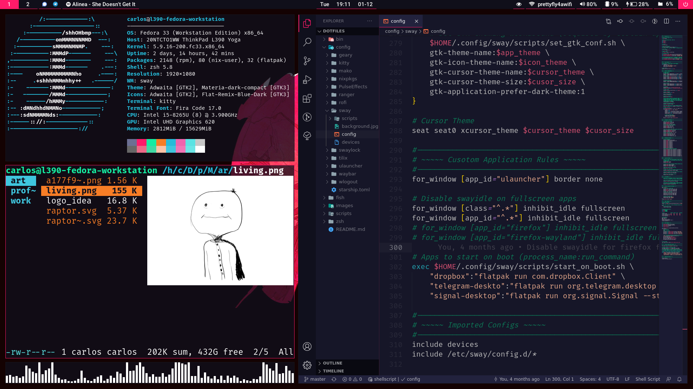

# dotfiles

Configs and scripts for my Linux machines.

# Folders

- **bin**: binaries/scripts I want in my path
- **config**: files that go in `~/.config`
- **images**: it's the plural of image
- **scripts**: installation/setup scripts
- **zsh**: shell config

## Sway Workstation Preview (Currently Unused)

  
  

