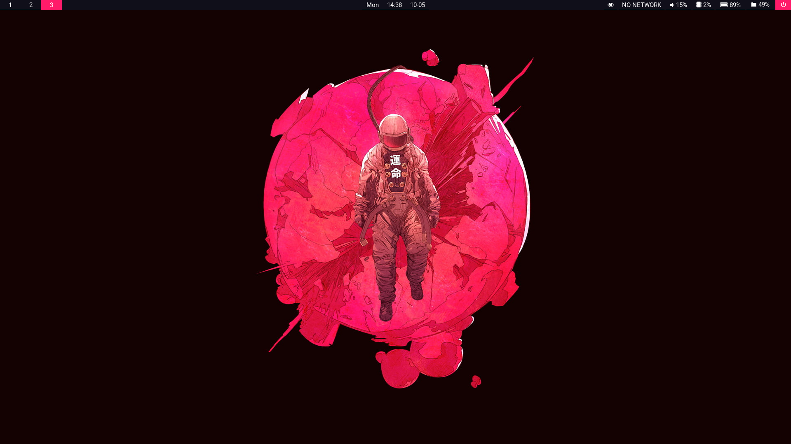

# dotfiles
Notes/Files I use to set up my Linux machines

# Folders
- **bin**: binaries/scripts I want in my path
- **config**: files that go in `~/.config`
- **images**: it's the plural of image
- **scripts**: installation scripts
- **zsh**: shell config